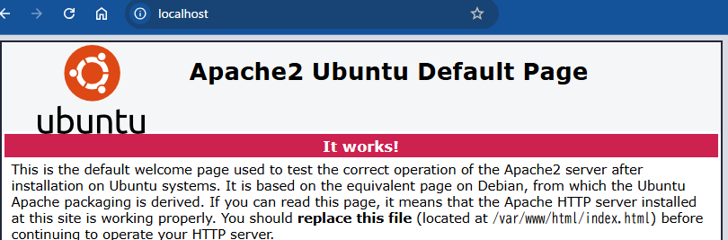
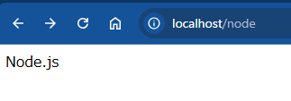

# Apache + PHP で構成したWebサーバー上に Node.js(express)を追加する手順

## はじめに
通常はPHPでWebアプリを実行しているけど、Node.jsも併用したい場合があります(WebSocketを利用してリアルタイムに通信したい場合など)

そのような場合、Apacheをリバースプロキシとして動作させて一部のURL(パス)をNode.jsに転送することで併用することができるようになります


## 概要
http://localhost/node にアクセスがあった場合は、Node.js側で実行

それ以外ではphpで実行したい場合は、(Apacheの)リバースプロキシを利用することで実現します

具体的には、特定のパス(上記では/node)にアクセスがあった場合、Node.jsへ転送する設定を行います。
（転送時は、Node.jsのプログラムを先に起動しておいて接続待ち状態にしておきます）

ここではUbuntu環境を前提に手順を記載します


1. Apache環境の設定
    1. リバースプロキシモジュールの読み込みの設定を行う
    1. リバースプロキシの設定を追加する
2. Node.js環境の設定
    1. Webアプリを作成するための準備(express)を行う
    1. テスト用のNode.jsアプリを作成して、起動する


## 1. Apache環境の設定

### 1.1 リバースプロキシモジュールの読み込みの設定を行う

標準ではリバースプロキシモジュールが読み込まれていません

`/etc/apache2/conf-enabled` に`proxy.load`、`proxy_http.load`が存在しないことを確認後、下記コマンドでモジュールを有効化します

```
$ sudo a2enmod proxy
$ sudo a2enmod proxy_http
```

### 1.2 リバースプロキシの設定を追加する

&lt;VirtualHost&gt;ディレクティブに`/node`へのアクセスをNode.jsに転送するための設定を追加します

VirtualHostのデフォルト設定`/etc/apache2/sites-available/000-default.conf`ファイルに、下記内容を追加します

```
<VirtualHost *:80>
  # ～～省略～～

    # Node.jsへのリバースプロキシ設定
    ProxyPass /node http://localhost:3333/node
    ProxyPassReverse /node http://localhost:3333/node

  # ～～省略～～
</VirtualHost>

```

* `/node`にアクセスがあった場合、Node.jsの3333番ポートへ転送を行います

設定完了後、Apacheの再起動を行います

```
$ sudo systemctl restart apache2
```


## 2. Node.js環境の設定

Node.jsはインストールされている前提です

### 2.1 Webアプリを作成するための準備(express)を行う

適当なディレクトリを作成し、[express](https://expressjs.com/ja/)をインストールします

```
$ node i express
```

### 2.2 テスト用のNode.jsアプリを作成して、起動する

`/node`にアクセスがあった場合に、`Node.js`と返すテストアプリを作成します

3333番ポートで待ち受けします

```javascript
const express = require('express');
const app = express();
const port = 3333;

app.use('/node', (req, res) => {
  console.log(`${new Date()} ${req.baseUrl}`);
  res.send('Node.js');
});

app.listen(port, () => {
  console.log(`listening on port ${port}`);
});

```

テストアプリを起動しておきます
```
$ node node.js
listening on port 3333
```


## 3. 動作確認

* `http://localhost`にアクセスしてApacheが動作していることを確認


* `http://localhost/node`にアクセスしてNode.jsのアプリが処理を行っていることを確認





Node.jsのコンソールには、`/node`にアクセスしたログが残っています
```
$ node node.js
listening on port 3333
Sun Dec 22 2024 22:46:16 GMT+0900 (日本標準時) /node
```
